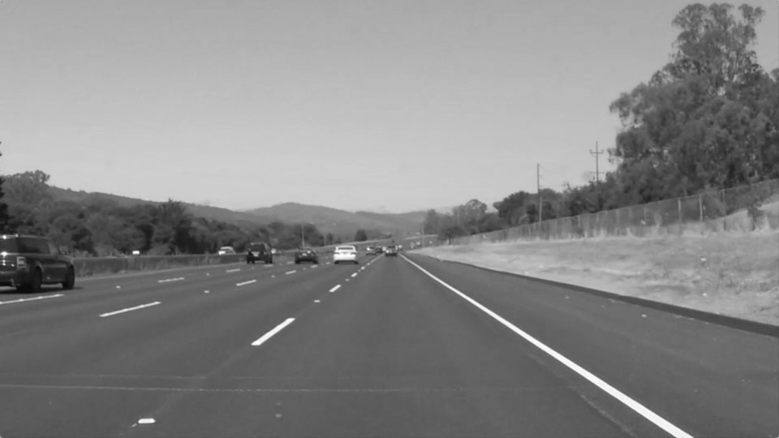
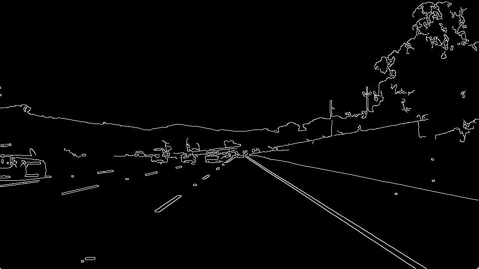
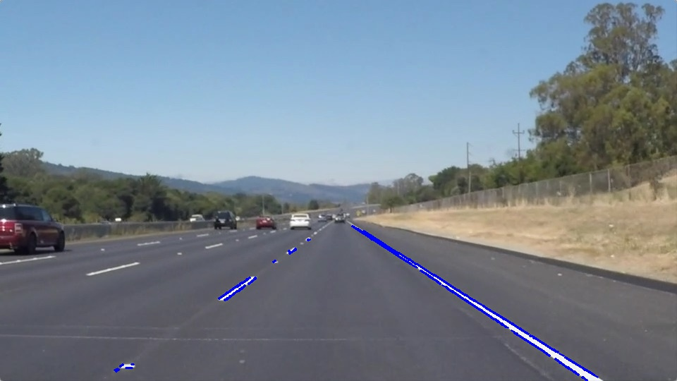
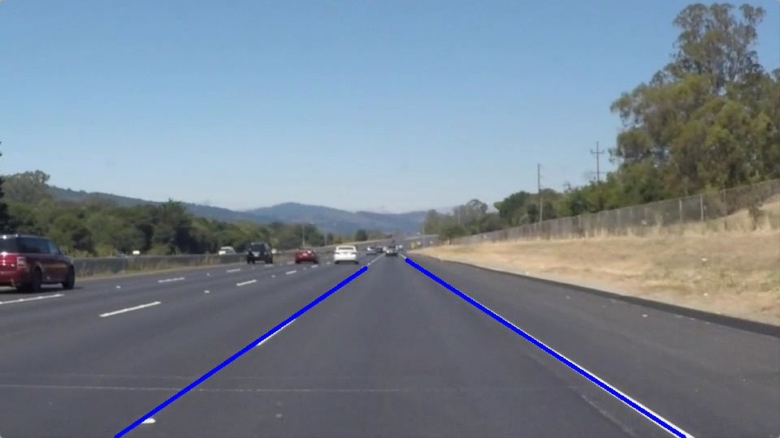

# **Project Reflection for Finding Lane Lines on the Road**

The goals of this project were the following:
* Create the following vision pipeline to find lane lines on a road
   * Import Python Packages
   * Import Filenames, Setup Image Paths, and Read Images
   * Read Images to Grayscale
   * Canny Edge Detection
   * Region of Interest to Create Masked Images
   * Hough Transform Feature Extraction
   * Map the Full Extent of Detected Lane Lines
* Report on the findings of the vision pipeline

[//]: # (Image References)

[image1]: ./test_images_output/grayscale.jpg  
[image2]: ./test_images_output/edges_detected.jpg

---

### Reflection

### 1. Describe your pipeline. As part of the description, explain how you modified the draw_lines() function.

This vision pipeline consisted of 7 steps.  Using Jupyter Notebooks, color image frames from vidoes were read to
grayscale as shown in Figure 1.  The images were processed using a low-pass filter to decrease Gaussian noise before
using a high-pass filter to find sharp edges (i.e. using a threshold Canny Edge Detector as shown in Figure 2). Before applying a hough transform feature extraction function to the images, a region_of_interest() function was used to eliminate everthing in the image except for the lane lines.  The hough_lines() function converted pixel-based segments of the Canny edges to line-based segments (refer to Figure 3).  Figure 4 shows the final result of the vision pipeline where the draw_lines() function was modified to map the full extend of the detected lane lines by calculating
the slope of each segmented line on the left and right side and separating them based on negative and positive slopes.
Also, a saggital plane was assumed to be at the middle of the image.  Furthermore, after determining the linear regression
parameters of the line-based segments, a slope-intercept equation was used to complete the full extent of the lane lines.

Figure 1: Grayscale Image    | Figure 2: Image of Detected Edges 
:-----------:|:----------------:
| 

Figure 3: Hough Line Segments    | Figure 4: Lanes Detected
:-----------:|:----------------:
| 

### 2. Identify potential shortcomings with your current pipeline

One potential shortcoming would be...what would happen when the region of interest changes from frame-to-frame? This
situation was encountered in the challenge output video.  

Another shortcoming could be when the end points of the full extended lines significantly changed which was also
encountered in the challenge output video.

### 3. Suggest possible improvements to your pipeline

A possible improvement would be to improve segmentation for a better defined region of interest.
Another potential improvement could be to improve the accuracy of the full extended lines by
using a polynomal fitting function instead of linear regression to account for lane lines along curves.

